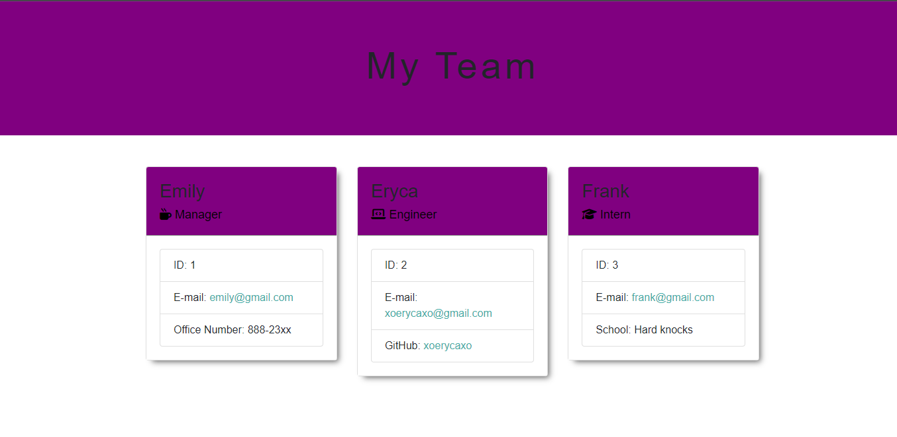

# team-profile-generator
challenge 10

## Description
This project is a Node.js command-line application that generates a team profile. It allows users to enter the general information about their employees of a software engineering team. The application would then take the input to generate an HTML page that displays a summary of each team member.
The HTML putput can be viewed at this [link](https://xoerycaxo.github.io/team-profile-generator/) and [here](https://github.com/xoerycaxo/team-profile-generator/blob/main/dist/index.html) to see my index.html file.

## Table of Contents

* [Installation](#Installation)
* [Usage](#Usage)
* [Contributing](#Contributing)
* [Tests](#Tests)
* [Questions](#Questions)

## Intstallation

1. To install this application, `git clone` this repository, or download the `.zip file` in the dropdown after clicking the green ‘Code’ button at the top of this repository—as long as it is in your local branch.
2. Make sure Node.js is installed.
3. Using the code editor of your choice, you need to install [Inquirer.js](https://www.npmjs.com/package/inquirer) node package by entering the following in the command line of terminal:
(`npm inquirer`)
4. In addition to Inquirer.js, you must install [Jest](https://jestjs.io/docs/getting-started) node package to run specific tests:
(`npm i jest`)

## Usage

Ensure that you are in the root directory in order for this application to run successfully. This application will initialize by running this command line in terminal:
`node index.js`

The Inquirer package for Node.js collects input regarding your team within the command line. Enter the employee's information as prompted, and it will organize that info & display it on an HTML page.

The newly-generated `index.html` file will be found in the (`dist`) folder that goes hand-in-hand with the `style.css` file already present there.

## Contributing

No contributions at this time. Thank you for your interest.

## Test

Enter the following command in terminal to run tests for this application:

`npm run test`

## Questions

Email: [xoerycaxo@gmail.com](xoerycaxo@gmail.com)
Github: [xoerycaxo](xoerycaxo)